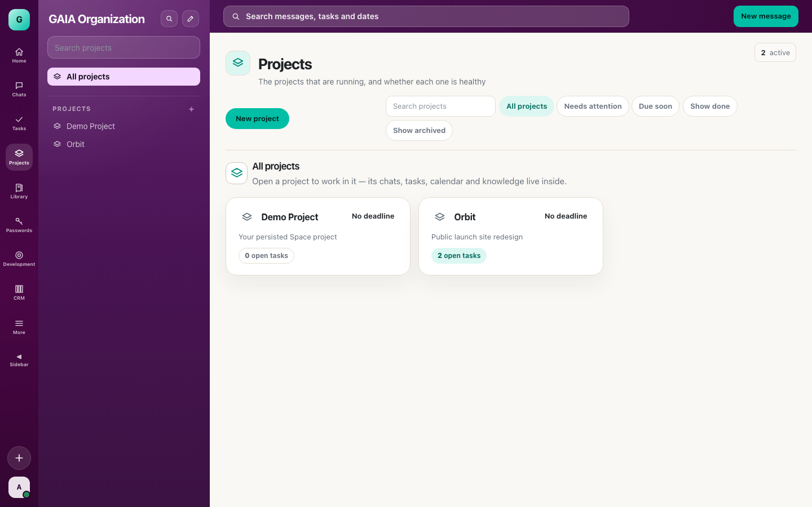
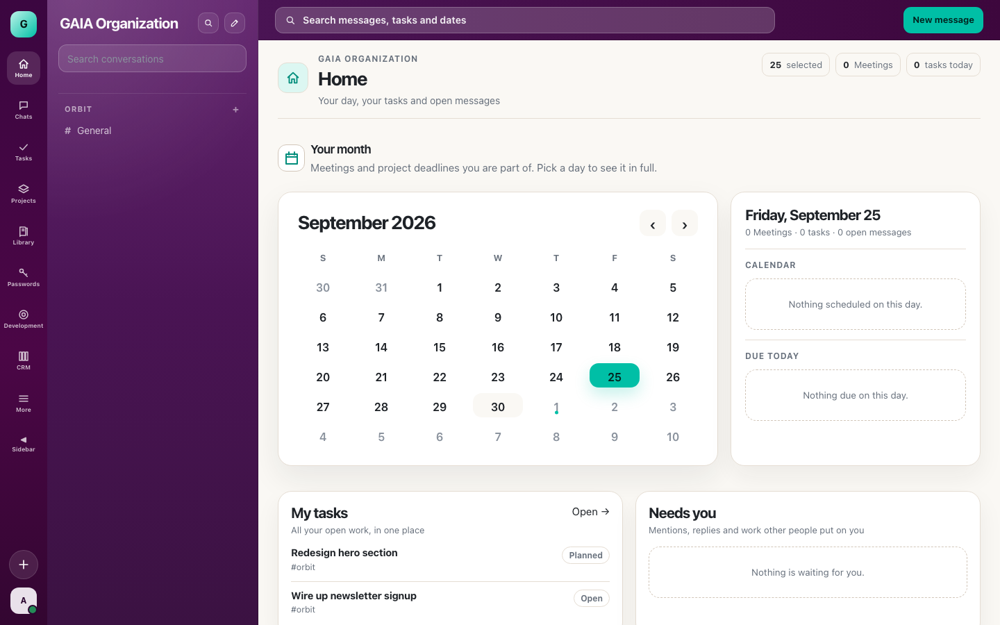
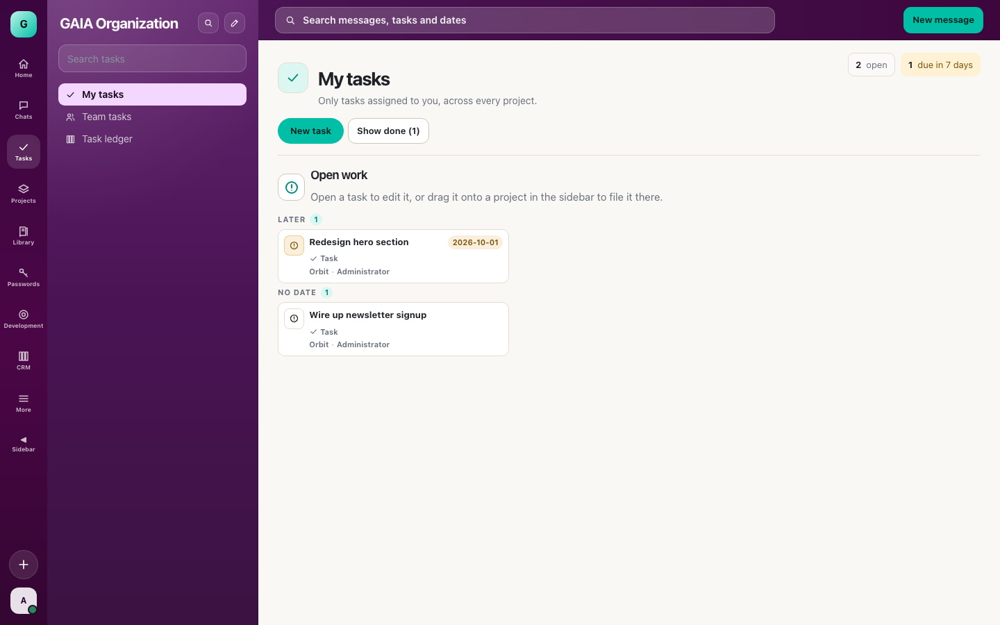
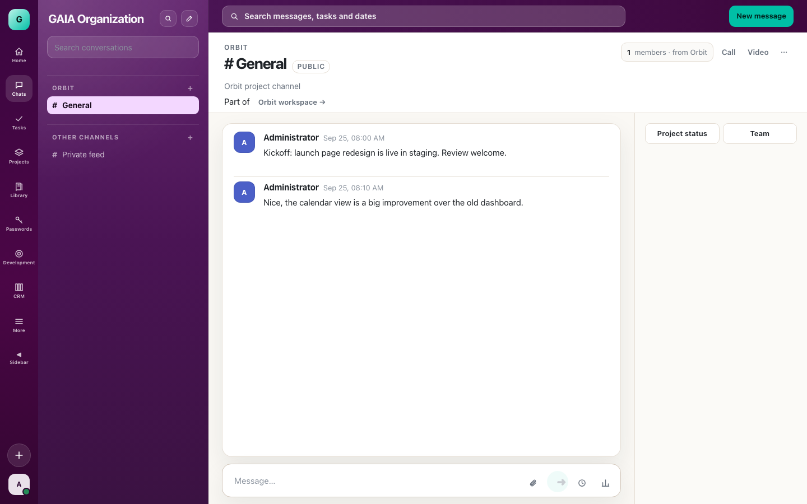

# GAIA Space

GAIA Space is a spiritual successor to JetBrains Space — the all-in-one dev/team platform (chat, tasks, projects, git & code review, CI/CD, docs, calendars, meetings) that JetBrains shut down in June 2025. GAIA Space is a from-scratch, open-source rebuild of that idea: one native app instead of a pile of disconnected SaaS tools, with your own server as the source of truth.

Built with [Tauri](https://tauri.app/) + [Solid](https://www.solidjs.com/) + TypeScript on the frontend and a [Rust](https://www.rust-lang.org/)/[axum](https://github.com/tokio-rs/axum)/SQLite backend (`space-server`), so it runs as a native desktop app or as a plain web app served behind your own domain.

## Screenshots

| | |
|---|---|
|  |  |
|  |  |

*(demo data — not a live/production instance)*

## What's in it

- **Chat** — channels, threads, mentions, pinning, drafts/typing, scheduled messages, polls, link unfurling
- **Tasks & Projects** — personal/team task lists, project workspaces, calendars, deadlines
- **Git & Code Review** — repo hosting, merge requests, diff review, CODEOWNERS, quality gates, stacked reviews
- **CI/CD & Packages** — pipelines, build workers, artifacts, a typed package registry
- **Documents & Meetings** — a knowledge base with rich documents, budgets/sheets, scheduled meetings and video calls
- **Directory & Auth** — profiles, teams, roles/rights, OAuth apps, SSO
- **Passwords vault** — a Vaultwarden-backed, same-origin password manager
- **HTTP API** — OAuth-scoped application tokens for third-party integrations

Feature parity against JetBrains Space is tracked in [`PARITY.md`](PARITY.md) (audited per domain, work ongoing — not everything is done).

## Getting started

```bash
bun install

# Desktop app (Tauri, no login required)
bun run tauri dev

# Backend API (SQLite-backed), separately
cd src-tauri && SPACE_DB=./space.db cargo run --bin space-server

# Or the web build, served behind /space/ and proxied to the backend
SPACE_SERVER_URL=http://127.0.0.1:8090 bun run dev -- --mode web
```

Checks: `bun run check` (typecheck), `bun test`, `cd src-tauri && cargo test`.

## License

MIT — see [LICENSE](LICENSE).
